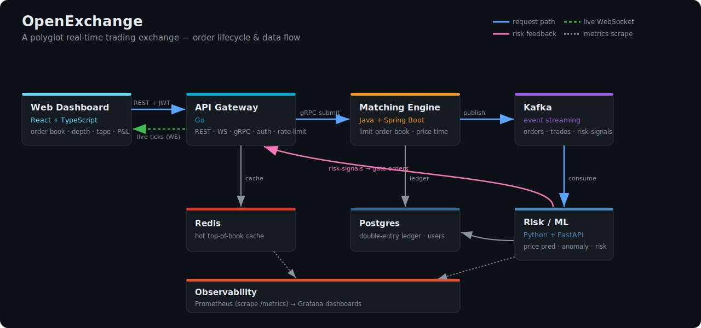
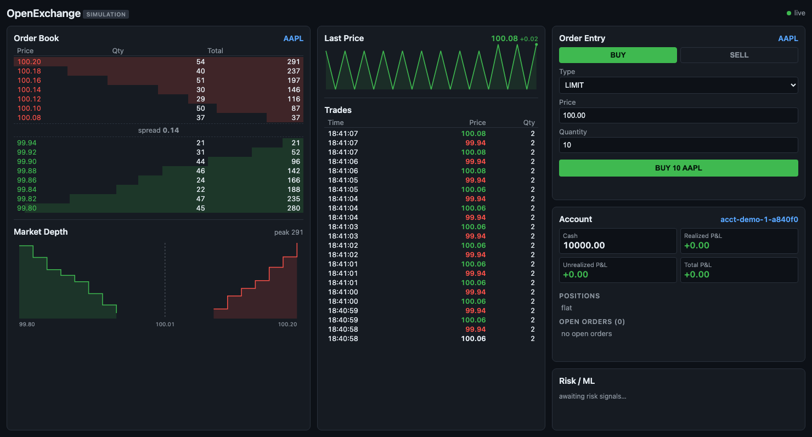
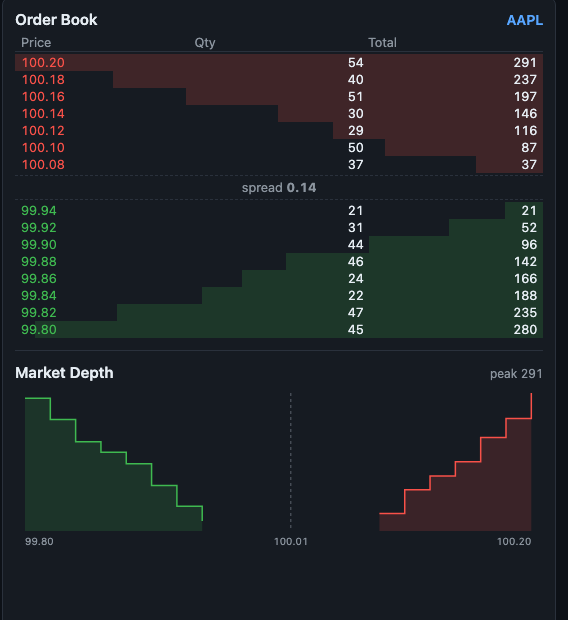
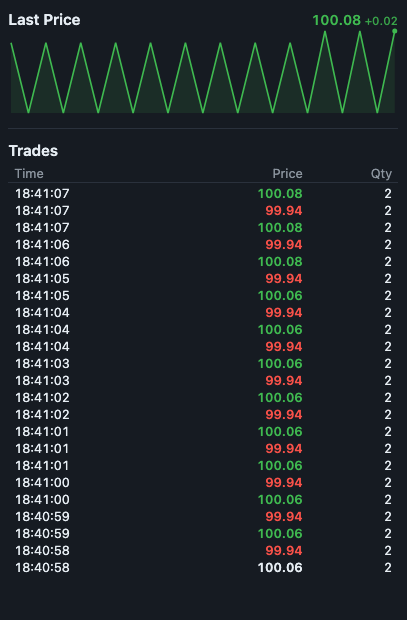
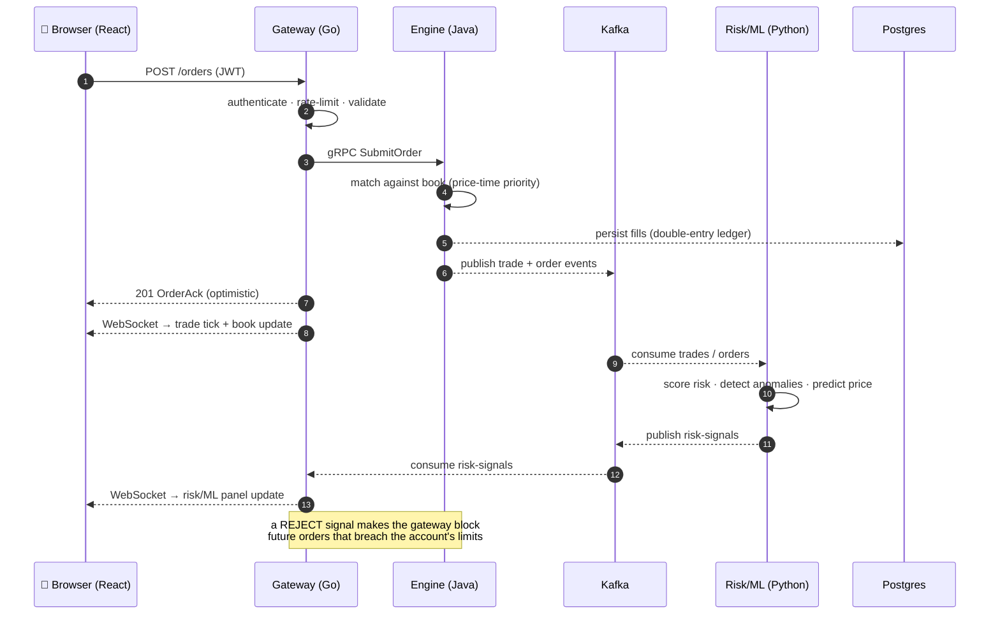

<div align="center">

# OpenExchange

**A polyglot, real-time trading exchange — built from scratch to show the hard parts of modern backend engineering in one coherent system.**

[](https://github.com/itsharsh007/openexchange/actions/workflows/ci.yml)
[](https://github.com/itsharsh007/openexchange/actions/workflows/docker.yml)
[](https://codespaces.new/itsharsh007/openexchange)

[**▶ Live dashboard**](https://itsharsh007.github.io/openexchange/) &nbsp;·&nbsp; [**🚀 Run the full stack (Codespaces)**](https://codespaces.new/itsharsh007/openexchange) &nbsp;·&nbsp; [**📖 Architecture**](docs/architecture.md) &nbsp;·&nbsp; [**📋 ADRs**](docs/adr/)

`Java` · `Go` · `Python` · `TypeScript` · `gRPC` · `Kafka` · `Postgres` · `Redis` · `Docker` · `Prometheus` / `Grafana`

</div>

<p align="center">
  
</p>

> ⚠️ **Simulation only.** OpenExchange uses *play money* and fake symbols. It handles no real funds and is not investment advice.

---

## What it is, in one paragraph

A user places an order in a **React** dashboard. A **Go** gateway authenticates it, rate-limits it,
and forwards it over **gRPC** to a **Java** matching engine, which matches it against a live limit
order book with **price-time priority** and writes the fills to a double-entry **Postgres** ledger.
Every trade is streamed over **Kafka** to a **Python** ML service that predicts short-term price
moves and flags risky / anomalous flow — and can signal the gateway to reject orders that breach
limits. The dashboard sees all of it live over **WebSockets**. Every box is real and runs.

## What it demonstrates

A trading exchange forces the whole surface of modern backend engineering into one coherent system:

| Area | Where OpenExchange shows it |
|---|---|
| **Data structures** | A per-symbol limit order book with price-time priority (`O(log n)` price levels, `O(1)` best-quote). |
| **Concurrency** | A single-writer-per-symbol matching engine — fast and correct without coarse locks. |
| **Distributed systems** | Four independent services coordinating over Kafka with at-least-once semantics. |
| **Databases** | A double-entry ledger that *always balances*, plus a Redis hot-book cache. |
| **Real-time networking** | WebSocket fan-out of trades, book, and risk signals to many clients. |
| **Machine learning** | Price prediction + anomaly/risk scoring wired back into the order path. |
| **Production ops** | 12-Factor config, JWT auth, Prometheus metrics, Grafana dashboards, CI, containers. |

## Highlights

- 🧩 **Real matching engine** — limit & market orders, partial fills, cancels, price-time priority, emits trades to Kafka.
- ⚡ **~16k orders/sec** write path and **~18k reads/sec** (Redis-cached) on a 4-core box — [numbers below](#performance--resilience).
- 🔐 **Real auth** — JWT access + refresh tokens, bcrypt-hashed passwords (full stack), with a frictionless guest mode for the public demo.
- 📈 **Live dashboard** — order book, **cumulative depth chart**, **streaming price chart**, trade tape, account P&L, and a risk/ML panel — all over one WebSocket.
- 🤖 **ML in the loop** — the Python service scores every trade and can gate the order flow in real time.
- 🛡️ **Resilient** — kill the engine mid-load and the gateway degrades cleanly (`502`, never a crash); the ledger stays balanced; it recovers on restart.
- 📊 **Observable** — every service exposes `/metrics`; Grafana shows latency, throughput, and fill rates.
- ☁️ **Deployed, free** — public dashboard on GitHub Pages, gateway on Render, one-click full stack in Codespaces.

## Screens

The live trading dashboard — order book with depth bars, a cumulative **market-depth chart**, a
streaming **last-price chart**, the trade tape, account P&L, and the risk/ML panel, all updating
over one WebSocket:

<p align="center">
  
</p>

| Order book + market depth | Live price + trade tape |
|---|---|
|  |  |

> ▶ Or just open the [**live dashboard**](https://itsharsh007.github.io/openexchange/) — it's a real shared exchange.

## How an order flows

The whole point of the system in one diagram — what happens between clicking **Buy** and seeing the
trade print, including the asynchronous ML feedback loop:



More diagrams — the risk feedback loop, deployment topology, and auth flow — live in
[**docs/architecture.md**](docs/architecture.md).

## Tech stack

| Service | Stack | Responsibility |
|---|---|---|
| [`engine/`](engine/)   | Java 17 + Spring Boot | Order book, matching, double-entry ledger |
| [`gateway/`](gateway/) | Go | REST + WebSocket + gRPC, JWT auth, rate limiting, Redis cache |
| [`risk/`](risk/)       | Python 3.12 + FastAPI | ML: price prediction, anomaly/fraud, risk scoring |
| [`web/`](web/)         | React + TypeScript + Vite | Live trading dashboard |
| [`proto/`](proto/)     | Protobuf | Shared service contracts (single source of truth) |
| [`deploy/`](deploy/)   | Docker Compose, K8s, Grafana | Local + cloud orchestration |

## Quick start (local)

```bash
# one-time: a free container runtime (macOS) — Linux can use Docker directly
brew install colima docker docker-compose && colima start

make up        # infra (Postgres, Redis, Kafka) + all services
make seed      # demo accounts/symbols + simulated order flow
make test      # every service's test suite
make down      # stop everything
```

Then open the dashboard at **http://localhost:5173**, place a **BUY** and a crossing **SELL**, and
watch them match — a trade prints on the tape, the depth chart and price chart move, the ledger
updates, and the Risk/ML panel reacts.

## Try it without installing anything

| | What you get | Setup |
|---|---|---|
| [**▶ Live dashboard**](https://itsharsh007.github.io/openexchange/) | A **real shared exchange** — your orders match against other visitors live. Open two tabs and trade with yourself, or send a friend the link. | none — just click |
| [**🚀 Open in Codespaces**](https://codespaces.new/itsharsh007/openexchange) | The **full system** — Java engine, Kafka, Postgres, and the ML risk loop | one click → `make up && make seed` (~3 min) |

**Live endpoints:** dashboard → [itsharsh007.github.io/openexchange](https://itsharsh007.github.io/openexchange/) · gateway → [openexchange.onrender.com/healthz](https://openexchange.onrender.com/healthz) · WS → `wss://openexchange.onrender.com/ws`

> The hosted gateway runs a real in-process matching engine (`ENGINE_MODE=local`), so the public
> link is a genuine shared exchange — no JVM/Kafka needed. The heavier services (Kafka, Postgres,
> the ML loop) run in the full stack. On Render's free tier the first request after ~15 min idle
> takes ~1 min to wake.

## Performance & resilience

Measured on a 4-core Linux box, full stack up (real engine, Kafka, Postgres), `hey` at 50 concurrent
connections for 20s per path:

| Path | Throughput | Avg latency | Slowest |
|---|---|---|---|
| `GET /book/{symbol}` (read, Redis-cached) | **~17,800 req/s** | 2.8 ms | 264 ms |
| `POST /orders` (write, gRPC → engine) | **~15,800 req/s** | 3.2 ms | 44 ms |

**Resilience** ([`scripts/chaostest.sh`](scripts/chaostest.sh)) — killing the engine mid-flight:

- Orders return a clean `502`; the gateway never crashes and `/healthz` stays `200` (degraded, not dead).
- The Postgres ledger is untouched and stays **balanced** (every asset nets to 0) throughout.
- On engine restart the gateway recovers automatically — orders return `201` again.

Reproduce: `make up && make seed`, then `./scripts/loadtest.sh` and `./scripts/chaostest.sh`.

## Documentation

| | |
|---|---|
| [🧒 Explained simply](docs/explain-like-im-10.md) | The no-jargon version — read this first |
| [📐 Architecture](docs/architecture.md) | Diagrams, data flow, design decisions |
| [📋 ADRs](docs/adr/) | One record per major architectural decision |
| [⚙️ Twelve-Factor map](docs/twelve-factor.md) | How each factor is satisfied |
| [☁️ Cloud deploy](docs/cloud-deploy.md) | Deploy your own, no credit card |

## Docker images (GHCR)

Every merge to `main` publishes four images:

```
ghcr.io/itsharsh007/openexchange-{engine,gateway,risk,web}:latest
```

## License

MIT — see [LICENSE](LICENSE).
