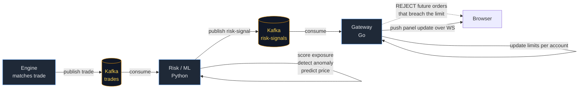
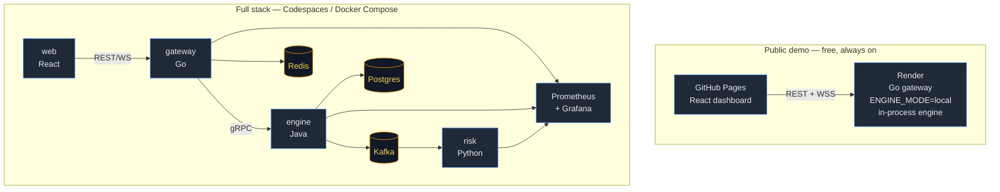
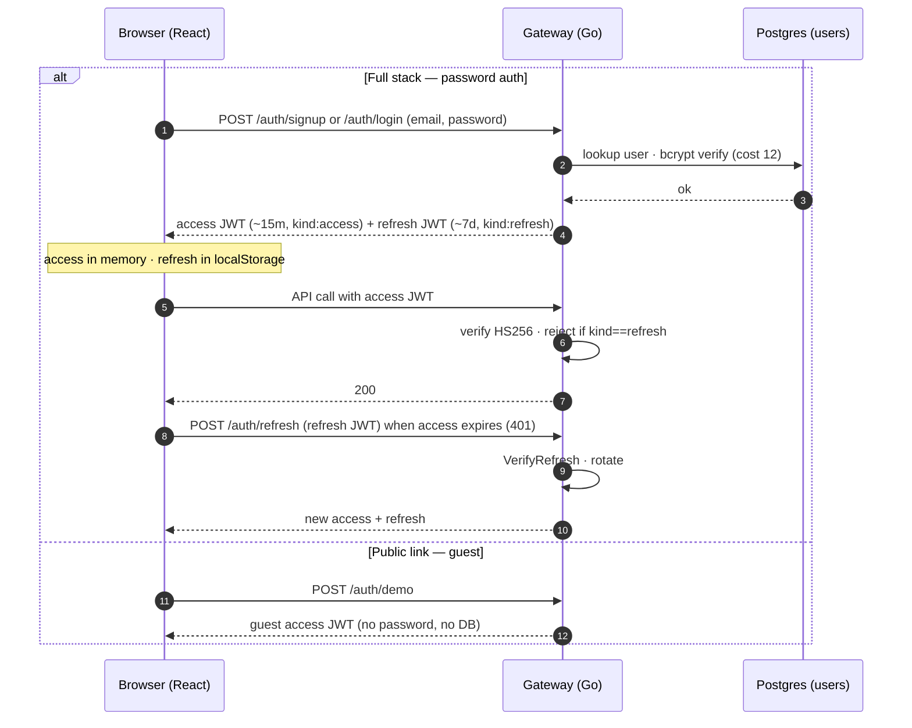

# Architecture

## Goals
- Realistic exchange mechanics (price-time priority matching) that are correct and fast.
- Clear service boundaries, each in a different stack, communicating over well-defined contracts.
- Observable, testable, and deployable on free infrastructure.

## Diagrams

### Risk / ML feedback loop

Every trade fans out asynchronously to the Python risk service over Kafka. The service scores it,
and a breach publishes a `risk-signal` the gateway consumes to gate *future* orders — the trade that
triggered it is never blocked retroactively, so the hot path stays fast.

### Deployment topology

The public link and the full stack are the **same code** in two run modes. The hosted gateway runs
the matching engine in-process (`ENGINE_MODE=local`) so the free demo needs no JVM/Kafka/DB; the
full stack splits every box onto its own service.

### Auth flow

The full stack uses bcrypt passwords + a short-lived access JWT (in memory) and a rotating refresh
JWT (localStorage). The `kind` claim stops a refresh token being replayed as an access token. The
public link keeps the frictionless **guest** path instead.

## Components

### Matching engine (`engine/`, Java 17 + Spring Boot)
Authoritative source of truth for order state. Holds an in-memory **order book per symbol**:
- Each side (bids/asks) is a price-ordered map of price level → FIFO queue of resting orders.
- Bids sorted descending, asks ascending, so best prices are at the head.
- Matching: an incoming order is checked against the opposite side's best price; fills are produced
  in **price, then time** priority until the order is filled or no longer crosses.
- Supports LIMIT and MARKET orders, partial fills, cancel, and amend.
- **Self-match prevention:** an incoming order never executes against the *same account's* resting
  orders — they're skipped (held aside, then restored) so the account's own liquidity keeps its
  queue position while the order still fills against everyone else at that price. See
  [ADR 0008](adr/0008-self-match-prevention.md); implemented identically in the Java engine and the
  Go in-process engine.

**Concurrency:** one writer thread per symbol consuming a command queue. This avoids locks on the
hot path while keeping each book strictly serialized — easy to reason about and fast.

**Outputs:** trade events + order-status events to Kafka; fills persisted to the Postgres ledger.

### Gateway (`gateway/`, Go)
The network edge. REST for order submit/cancel, WebSocket fan-out for live book + trades, gRPC
client to the engine. Cross-cutting concerns: JWT auth, token-bucket rate limiting, request
validation, Redis caching of top-of-book.

**Two engine modes.** `ENGINE_MODE=grpc` (full stack) forwards to the Java engine over gRPC.
`ENGINE_MODE=local` runs a real in-process matching engine inside the gateway — same matching and
self-match rules, an in-memory ledger, no JVM/Kafka/DB. This is what powers the always-on public
demo.

**Market simulator (local mode only).** When the in-process engine is active the gateway runs bot
accounts (`sim-mm` maker, `sim-taker-a/b` takers) that random-walk a mid price and continuously
quote and trade all demo symbols, so the public link is a live, moving market with zero visitors.
It's controllable at runtime: `GET /sim/state`, `POST /sim/pause`, `POST /sim/resume` — the
dashboard exposes these as a one-click **pause/resume bots** toggle. Disabled by default on the full
stack (no `/sim` route), so the toggle only appears where bots actually run.

The WS hub broadcasts every symbol to every client; the dashboard filters by the symbol selected in
its header tabs (AAPL / TSLA / MSFT).

### Risk / ML (`risk/`, Python + FastAPI)
Kafka consumer building a feature store in Postgres. Three models:
1. **Price prediction** — short-horizon next-tick direction (gradient-boosted trees).
2. **Anomaly / fraud** — isolation forest over order-pattern features (size, frequency, timing).
3. **Risk exposure** — per-account position/exposure scoring against limits.
Exposes FastAPI endpoints and publishes risk signals back to Kafka; gateway can reject breaching
orders.

### Web (`web/`, React + TS)
Live order book, depth chart, trade tape, order entry, account P&L, and an ML/risk panel. Subscribes
over WebSocket with reconnect/backoff.

## Backing services
- **Kafka** — event backbone (topics: `orders`, `trades`, `market-data`, `risk-signals`).
- **Postgres** — durable ledger + order history + feature store.
- **Redis** — hot cache for top-of-book and rate-limit counters.

## Key invariants
- The ledger always balances (double-entry): every trade debits one account and credits another.
- Order IDs are idempotent — re-delivery never creates duplicate trades.
- The engine is authoritative; Redis is a cache and may lag, bounded by refresh cadence.

See `adr/` for the reasoning behind each major choice.
